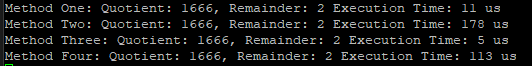
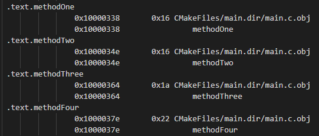

# MES Week 9 Optimizations

I implemented four methods for doing integer division with remainder.

Some worked better than others...

I tested everything with a numerator of 5000 and denominator of 3 for comparison.

## Methods

- Method 1 is 27 assembly instructions, and 22 bytes in flash.  This method executed in 11 us.
    - The smallest, and the second fastest algorithm. 
    - Good candidate for a balance of code size and speed  
- Method 2 is 38 assembly instructions, and 22 bytes in flash.  This method executed in 178 us
    - One of the smallest, but the slowest of all algorithms
- Method 3 is 26 assembly instructions and 26 bytes in flash.  This method executed in 5 us
    - The fastest, but not the smallest algorithm
    - Good for when speed is key.
- Method 4 is 45 assembly instructions and 34 bytes in flash.  This method executed in 113 us.
    - Large and takes a while, but not the slowest

## Reference

### Execution Times

### Map File Info

